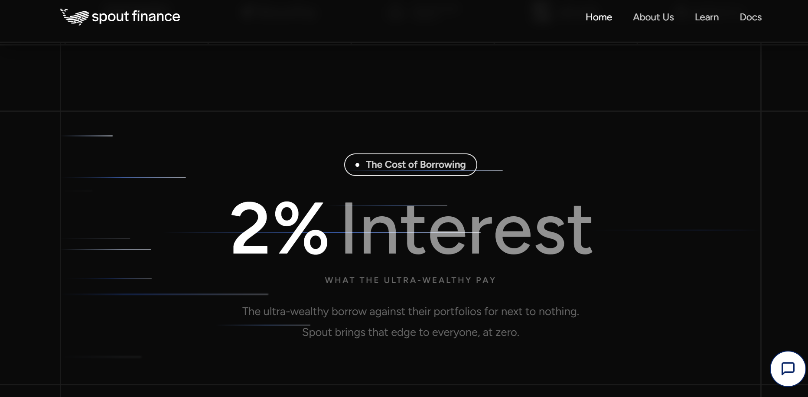
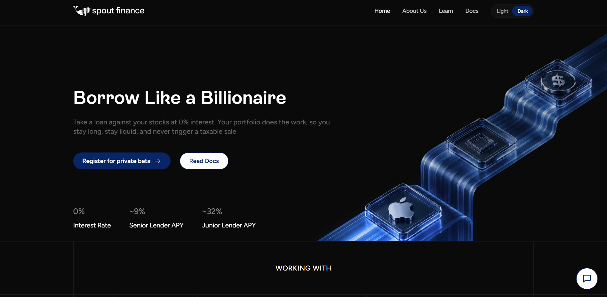
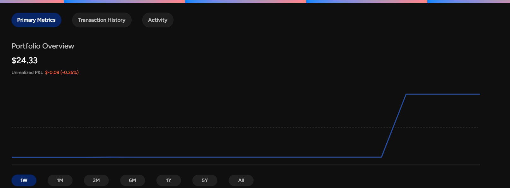
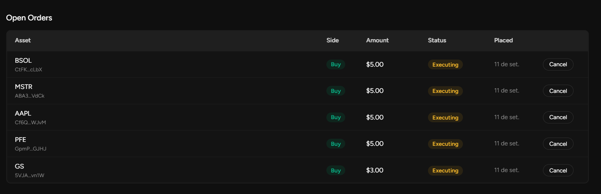
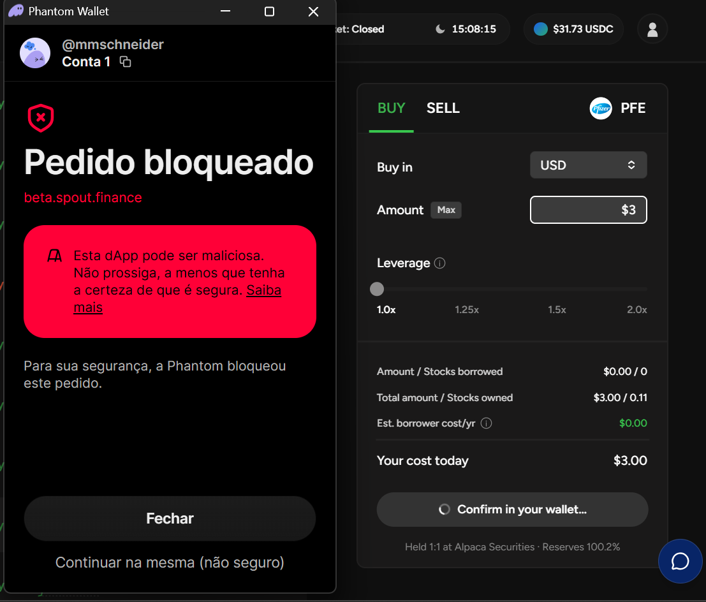
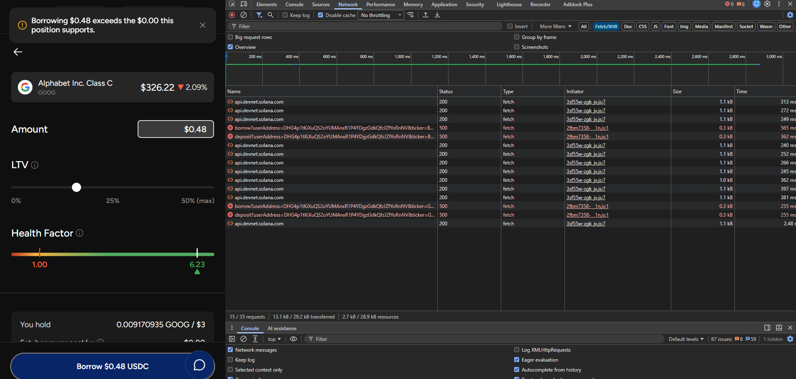
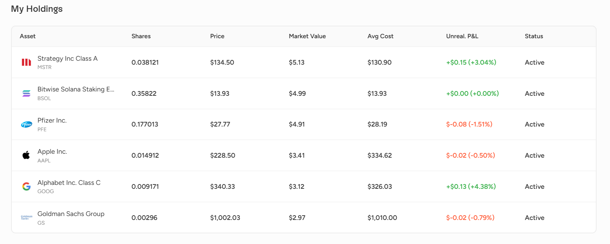
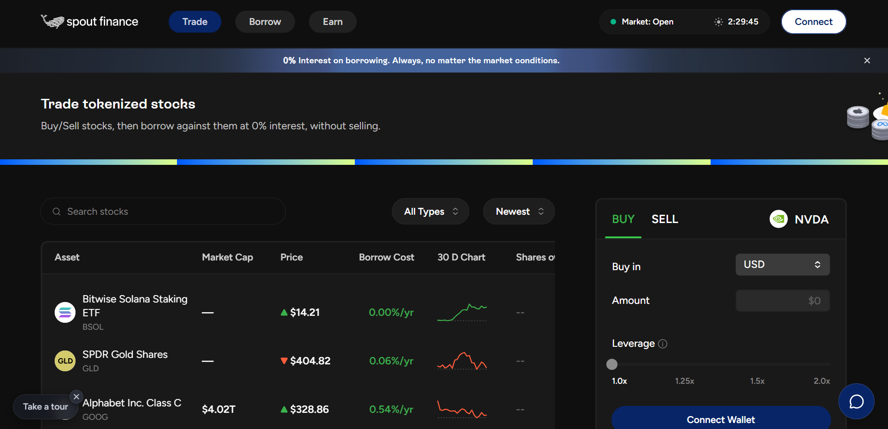
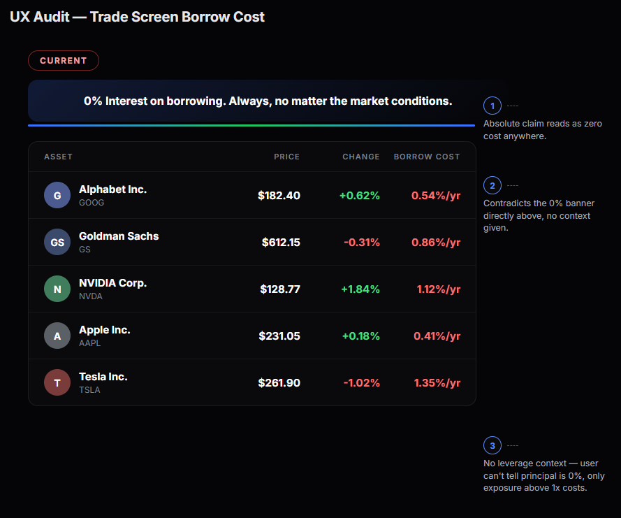
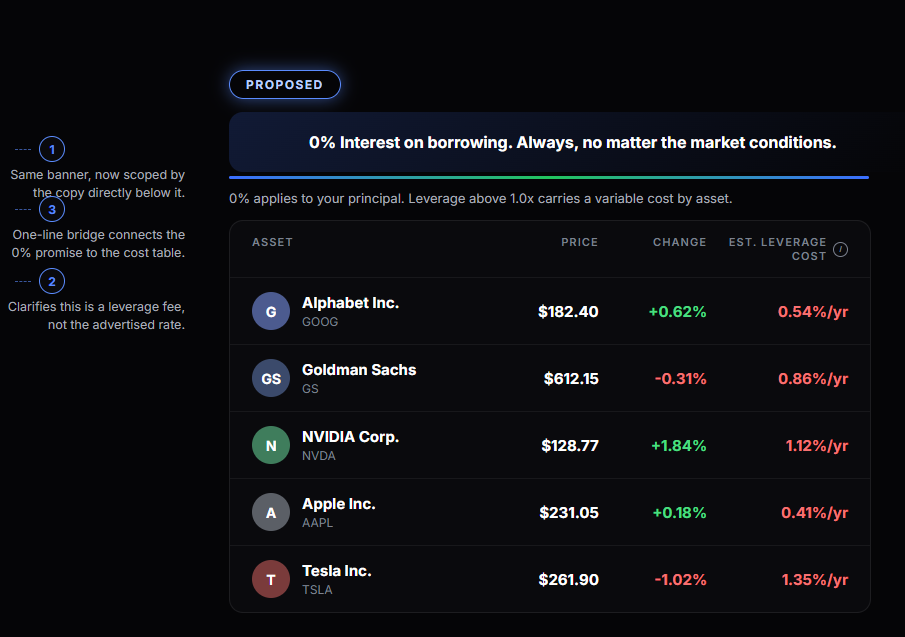

# Spout Finance — Beta Intelligence Challenge
### Testing Report, UX Audit, and DeFi/Tokenization Analysis

**Reviewer:** Mateus Schneider (@0xinaids) — full-stack Solana developer (Rust/Anchor), Superteam bounty hunter
**Testing period:** Sep 9–21, 2026 (12 days, real position held on devnet throughout the entire period)
**Environment:** Solana Devnet · Wallet `DHG4p1tKiXuQS2oYUMAnxR1P4YDgzGdkQfzJZfYoRnNV`
**Methodology:** full documentation review (31 pages) before touching the product, testing without a guided tutorial, diversification across 6 real positions, 9 consecutive days of portfolio monitoring, DevTools inspection (Network/Console/Sources), desktop and mobile Lighthouse audits, on-chain verification via Solscan devnet.
**Video walkthrough:** https://youtu.be/zO3SH9nMgsQ

---

## 0. Executive Summary

**28 findings** documented, broken down by severity:

| Severity | Count | Highlights |
|---|---|---|
| **Critical** | 9 | Entire portfolio showing "No Holdings"/"No Metrics" for 2+ consecutive days despite chart data still updating (FP-APP-20); sell order marked "Failed" but stuck mid-execution on-chain (FP-APP-16); site fails to render on mobile/Slow 4G (FP-MOBILE-1); Phantom Wallet fully blocks any transaction (FP-APP-5); raw account error + systematic 500s on `/vault/deposit` and `/vault/borrow` (FP-APP-12); incorrect Avg Cost/P&L on AAPL (FP-APP-15); liquidation fee documented as 5% flat but 8.8% in practice (FP-DOC-2); KYC publicly claimed but absent in practice (FP-APP-4/6) |
| **High** | 6 | "Borrow Cost" column contradicts the "0% Always" banner (FP-APP-1); devnet environment not persistently flagged (FP-APP-14); yield figures diverge across docs pages (FP-DOC-1); "no losing your upside" contradicts the actual assignment mechanic (FP-DOC-3); asset tickers in Open Orders replaced with garbled address fragments, a regression (FP-APP-21) |
| **Medium** | 7 | Borrow panel opens on the wrong asset by default (FP-APP-13); undocumented terms (FP-DOC-4/5); "Executing" status shown incorrectly while market is closed (FP-APP-7); "2%" flash during landing page load (FP-LANDING-1); no "my holdings" filter (FP-APP-19); sell modal reuses buy confirmation copy (FP-APP-17) |
| **Low** | 4 | Share rounding (resolved in Portfolio view); inefficient RPC polling; SEO 91/100 |

**The core thesis in two sentences:** the product has a genuinely differentiated financial model (RWA as collateral, yield via covered calls, conservative 50% LTV) and a back-end that, most of the time, calculates correctly — but the communication layer (marketing, docs, error messages, transaction status) has not been reconciled with the actual implementation anywhere. The result is a product that scares users on first contact (Phantom blocking the wallet), confuses them mid-flow (contradictory banners), and, in the worst case found, shows "Failed" for a transaction that actually just got stuck in an intermediate on-chain state.

**One-sentence test:** *"Spout Finance lets you borrow stablecoins at 0% interest against tokenized stocks — funded by covered calls on those same assets — but still communicates liquidation risk, leverage, and transaction status as if it were polished traditional fintech, not the beta-stage derivatives product it structurally is."*

**The 3 fixes that would move the needle immediately:**
1. **Resolve the Phantom security flag** (direct outreach to Phantom/Blowfish for domain allowlisting) — this is the highest and cheapest-to-remove conversion barrier; without it, most Phantom users never complete a first transaction.
2. **Fix the `/api/vault/deposit` and `/api/vault/borrow` endpoints** that return 500s systematically, and investigate why sell orders get stuck in `placeSellOrder` with no matching `fulfillSellOrder` (FP-APP-16) — this affects the perceived reliability of the core product feature.
3. **Run a reconciliation audit between docs/marketing and the real UI** (yield 7% vs 9%, liquidation fee 5% vs 8.8%, "no losing upside" vs assignment, KYC "enforced" vs absent) — a single review pass would resolve 5+ findings at once.

---

## 1. Methodology and Reviewer Profile

Before touching the product, I did a full pass through all 31 pages of `/docs`, without following any guided in-app tutorial during the first session — the goal was to document real hesitation, not the happy path. I tested with Phantom Wallet (browser extension), diversified across 6 assets of varying volatility (GOOG, MSTR, BSOL, AAPL, PFE, GS) specifically to compare "Borrow Cost" and liquidation fee behavior between stable and volatile assets, and kept the position active for 9 consecutive days, including a weekend-to-market-open transition (to test closed-market → open-market behavior).

---

## 2. Landing Page Analysis

The landing page (`spout.finance`) has strong design — dark theme, neon blue accents, bold typography — a consistent and professional visual. The main hero section ("Borrow Like a Billionaire") correctly features "0%" as the headline number, alongside lender APYs (9% senior / 32% junior) that match the docs.

**FP-LANDING-1 (Medium):** the "The Cost of Borrowing" section briefly displays **"2% Interest — What the ultra-wealthy pay"** during load, before settling on the correct final value ("0% Interest — What you pay with Spout"). It's a transient flash — likely an animated counter or a hydration state — but a screenshot/screen recording taken at the wrong moment captures the incorrect version, exactly as happened in our own test. Recommendation: start the counter from a neutral value ("—%") instead of "2%", or ensure the SSR already ships the correct final value before JS takes over.

**Additional finding via SSR source HTML inspection (schema.org):** the structured `FAQPage` block (indexed by Google/AI crawlers) contains the claim: *"enforces wallet-level KYC on all tokenized asset holders."* See Section 4, FP-APP-4/6, for the contradiction with observed behavior.

---

## 3. First Impressions (Session 1, no tutorial)

- The Trade screen loads price data **without requiring a connected wallet** — good zero-friction discovery.
- The connect flow (Privy → Phantom) is fast and clear; devnet activates automatically with test funds credited without needing to request them from the faucet manually.
- Two real hesitations on the first screen: (1) the "0% Interest. Always." banner is immediately contradicted by the "Borrow Cost" column right below it; (2) a "Leverage" slider (1.0x–2.0x) in the buy flow, with no mention anywhere in the 31 documentation pages.

---

## 4. Friction Points (by severity)

### 🔴 CRITICAL

**FP-APP-20 — Entire portfolio shows "No Holdings"/"No Metrics" for multiple consecutive days, despite the underlying data still existing**

Starting around Sep 19, the Portfolio screen began showing "No Holdings — Trade tokenized stocks to build your portfolio" and "No Metrics — Build your portfolio to see your total equity, borrowed amount, and net worth," as if the account had never held any position. The "Portfolio Overview" performance chart in the same view kept updating correctly in the background — it showed a historical peak of $27.35 (Sep 19) and later $28.08 (Sep 21, +9.06% unrealized P&L) — proving the underlying position data still exists and is being tracked, just not surfaced in the holdings/metrics views. Checked again two days later (Sep 21): the exact same broken state persists. This is not a one-off glitch; it's a sustained failure for this specific account, lasting at least 2+ days.

*Why this is critical:* there is no indication of a real liquidation (Total Borrowed has always been $0, no margin-call risk), so this is almost certainly a display/fetch bug rather than actual loss — but the user experience is indistinguishable from "my money is gone" until proven otherwise, and a real user in this state has no way, inside the product, to see what they own.

*Suggested fix:* investigate why the holdings/metrics endpoints fail persistently for this account while the chart/history endpoints keep working; add a fallback state that shows cached last-known values with a "data may be stale" notice instead of a blank "No Holdings" empty state.

---

**FP-APP-16 — Sell orders stuck in an intermediate on-chain state, incorrectly labeled "Failed"**

Two sell orders (GOOG and PFE) appeared in the Open Orders table with a "Failed" status, but shares were effectively debited from holdings in the exact quantity recorded in the order. At first this looked like "the sale executed but the system lies about the result" — already serious on its own. Deeper investigation via **Solscan devnet** revealed the real root cause: the wallet's on-chain history shows a `placeSellOrder` instruction for both transactions, but **no matching `fulfillSellOrder` instruction** follows. The order was genuinely placed on-chain (hence the holdings dropping — shares get reserved/locked), but the settlement step (which would return USDC) never happened. The wallet's USDC balance stayed at $8.73 before and after, confirming no credit occurred.

This is not a fund loss — it's an order stuck in a pending state that the UI incorrectly labels as terminal/"Failed" (implying nothing happened) when it should show "Pending Fulfillment" or similar. A user seeing "Failed" might try to sell again, or simply lose trust in the displayed balance.

*Bonus technical finding:* the same wallet's purchase history shows a repeated pattern of `adminThaw` followed by `fulfillBuyOrderFreezeGated` — confirming that the compliance architecture (Token-2022 transfer hooks described in the docs) genuinely exists on-chain, with tokens minted "frozen" and released by an admin instruction. On devnet, this thaw appears to happen automatically, with no visible real KYC gate.

*Suggested fix:* rename the status to reflect the real state ("Pending Fulfillment"/"Stuck — Contact Support"), investigate why fulfillment isn't being triggered after placement, and consider an automatic timeout with cancel/retry.

---

**FP-MOBILE-1 — Site fails to render on mobile under Slow 4G throttling (NO_FCP)**

PageSpeed Insights in Mobile mode (emulated Moto G Power, Slow 4G — Google's default test scenario, not an extreme edge case) returned **total rendering failure**: "The page did not paint any content (NO_FCP)" across every performance metric, plus widespread errors across nearly all Accessibility/Best Practices/SEO audits, because Lighthouse couldn't even load the page to analyze it. This contrasts sharply with the desktop result (100/100/100/91, see FP-APP-11). It suggests a bundle-size or network-dependency issue under limited bandwidth, consistent with the already-documented inefficient polling (FP-APP-10) and the heavily fragmented JS bundle previously observed.

*Suggested fix:* investigate bundle splitting and lazy loading to reduce initial payload on slow connections; test manually on a real device with network throttling before mainnet launch.

---

**FP-APP-5 — Phantom Wallet fully blocks transactions (buy and sell) with "this dApp may be malicious"**

Every transaction tested (buying GOOG, BSOL, PFE; selling GOOG) triggered escalating Phantom warnings: from "this dApp may be malicious" (warning) to "Request blocked" (full block, with only a small "Continue anyway (unsafe)" link to proceed). This affects any Phantom user (the most popular wallet in the Solana ecosystem) attempting any operation — it isn't specific to one asset or flow. Reported to the team via Telegram during testing; their response confirmed it's a pre-audit beta, but didn't address the root cause (domain reputation blocklisting, resolvable via direct outreach to Phantom/Blowfish independent of the smart contract audit status).

*Suggested fix:* request an allowlist/false-positive review from Phantom's security team before public launch; consider adding an in-app notice preparing users for this alert during the beta period.

---

**FP-APP-12 — Raw on-chain account error + systematic 500s on `/api/vault/deposit` and `/api/vault/borrow`**

The Borrow screen displayed the raw error `CollateralType: unexpected length 213 (expected 165, or 149 pre-migration)` — initially looking like an Anchor account schema migration issue. Investigation via the Network tab revealed the real root cause: the `/api/vault/deposit` and `/api/vault/borrow` endpoints return **500s systematically**, for any ticker tested (incorrect default XOM, correctly selected GOOG, multiple borrow amounts). The error persists regardless of asset or amount, confirmed across multiple sessions and also independently reproduced by a second tester from the same beta cohort (externally corroborated finding). This 500 produces a side effect: an incorrect "Borrowing $X exceeds the $0.00 this position supports" warning appears even with a healthy Health Factor (6.23–37.40) and a correct "Est. borrower cost/yr: $0.00."

*Suggested fix:* never let a parsing exception leak as raw text into the UI; investigate why both endpoints return 500 (likely related to the same underlying account mechanism causing FP-APP-16); handle the 500 client-side without propagating it as "$0.00 capacity."

---

**FP-APP-15 — Incorrect Avg Cost and P&L for AAPL (financial data integrity bug)**

Of the 6 diversified positions, 5 calculate correctly (mathematically validated: shares × avg cost = original order value, and P&L matches the difference between avg cost and current price). The AAPL position is the outlier: displayed Avg Cost is $334.62, while the asset's current price is ~$228.50 (a 46% difference). If Avg Cost were correct, the real loss would be -31.7% (~$1.58); the screen shows "-0.50%" — a third, entirely different number that matches neither the wrong Avg Cost nor a correct one. This suggests two diverging data sources feeding Avg Cost and the P&L display.

*Suggested fix:* audit the execution-price recording at fill time for AAPL specifically (possible cache/price collision with another asset); ensure P&L always derives from the same Avg Cost shown, never from a separate source.

---

**FP-DOC-2 — Liquidation fee documented as 5% flat, but 8.8% in the worked example**

`/liquidation` and `/fee-structure` state a flat 5% fee ("better than the DeFi standard of 10-15%"). But the worked example in `/scenarios` uses "NVDA's liquidation fee (8.8%, its per-asset buffer)" — language suggesting a per-asset variable fee. If the real fee varies by volatility (which makes sense from a risk standpoint), the "5% flat" marketing claim hides that volatile assets pay nearly double the advertised rate.

*Suggested fix:* publish the fee per asset (as is already done for LTV/cycle in `/supported-collateral`), rather than a generic flat number that practice contradicts.

---

**FP-APP-4/6 — Public FAQ (schema.org, indexed by Google) claims mandatory KYC; total absence observed in practice**

The source HTML of `spout.finance` contains a structured `FAQPage` block with two explicit answers: *"complete a one-time KYC verification"* and *"enforces wallet-level KYC on all tokenized asset holders."* This is a public, indexable claim (Google, AI assistants) about regulatory compliance, with no caveat for beta/devnet. Across the entire tested journey (connect, buy, sell, borrow) — no KYC step appeared at any point, in any environment. On-chain evidence (the `adminThaw`/`fulfillBuyOrderFreezeGated` pattern) confirms the freeze/thaw architecture exists, but the "thaw" happens with no visible verification gate on devnet.

*Suggested fix:* either implement the KYC gate even in beta (at least simulated, to validate enforcement before mainnet), or add an explicit caveat to the public FAQ: "KYC enforcement is active on mainnet; the current devnet beta does not require it."

---

### 🟠 HIGH

**FP-APP-1 — "Borrow Cost" column with values >0% contradicts the "0% Interest. Always." banner**
Same Trade screen: the banner promises "always 0%," the asset table shows a Borrow Cost of 0.06% to 0.86%/yr per asset. The real explanation (found via the public FAQ, not the UI): this cost is the average covered-call assignment risk (~0.5% historical annualized), not traditional interest — but this is never explained inside the product, only in the external FAQ.

**Proposed fix:**

**FP-APP-14 — Devnet environment not persistently flagged**
The "Wallet verified for devnet" toast appears once and disappears; there's no persistent badge reminding the user they're in a test environment while navigating. This produced genuine confusion even for a technically experienced user.

**FP-DOC-1 — Yield targets diverge across docs pages**
`/introduction` and `/how-lending-works`: 9%/32%. `/what`: 7%/25%+. `/lending-tranches` confirms 9%/32.8% as the real numbers (7% is just the "priority yield" before the excess split).

**FP-DOC-3 — "No losing your upside" contradicts the real assignment mechanic**
The landing page/`/introduction` promises "no losing your upside"; `/covered-call-strategy` and `/options-assignment` make clear that upon assignment, shares are sold at the strike, sacrificing upside above it for that cycle.

**FP-APP-21 — Asset tickers in Open Orders replaced with garbled address fragments (regression)**
The same two stuck orders from FP-APP-16 (PFE and GOOG, initially shown as "PFECLzi…UbBA" and "GOOG7zo3…H3nV" — ticker prefixed to address) later rendered as "EG3r…CLzi…UbBA" and "6a2y…7zo3…H3nV" — the ticker disappeared entirely, leaving only illegible on-chain address fragments. This is a regression: the same screen got worse over the course of testing, not better. Combined with FP-APP-20, it suggests a broader failure in the layer that resolves asset metadata (name/ticker) from on-chain addresses, not isolated to these two specific screens.

---

### 🟡 MEDIUM

- **FP-APP-13** — The borrow panel opens pre-selected on an asset (XOM) the user doesn't own, instead of the user's actual position asset.
- **FP-DOC-4** — The term "LP reserve" is mentioned in `/distribution` with no explanation anywhere else or in the glossary.
- **FP-DOC-5** — The Insurance Fund's circuit breaker has no publicly disclosed numeric threshold.
- **FP-APP-7** — "Executing" status shown even while the market is closed (should read "Queued"/"Pending Market Open"); confirmed across 6 different orders throughout testing.
- **FP-APP-17** — The sell confirmation modal reuses the "Your purchase has been confirmed" copy (template bug, also independently confirmed by another tester).
- **FP-APP-19** — No "my holdings only" filter in the Trade/Sell table; with a diversified portfolio, finding your own positions requires scrolling the entire table.

---

### 🟢 LOW

- **FP-APP-8** — Share rounding in the post-purchase confirmation modal ("0.01 GOOG" when the real amount is 0.009171); correctly resolved in the Portfolio view (shows "< 0.01" or the full value).
- **FP-APP-10** — Active RPC polling roughly every 150ms instead of WebSocket subscription; works fine on devnet, won't scale on a public RPC in production.
- **FP-APP-11 (SEO)** — Missing `<meta name="description">`.

---

## 5. What Works

- **Excellent desktop performance:** Lighthouse 100/100/100/91 — well above the average of comparable DeFi protocols previously tested.
- **No leaked keys/secrets**, confirmed via Network and Sources tab inspection.
- **Correct, real-time LTV/Available Borrowing Power calculation** as the position's market value changes (validated over 9 days of monitoring).
- **Transparent behavior with a closed market:** the "fills at 9:30 AM ET" notice was honored exactly as promised.
- **Complete Transaction History with CSV export** — a good sign of a product built with user-side auditability in mind.
- **Well-designed loss waterfall**, documented with concrete numbers (Insurance Fund → Junior → Senior).
- **Earnings skip for individual stocks** (no calls written during earnings) — a risk consideration few protocols think to implement.
- **Verifiable FinCEN MSB registration**, reinforcing regulatory legitimacy.
- **Cross-source number consistency:** the lender/protocol fee split (80/20) matches exactly between the public FAQ and `/fee-structure` — a sign that at least part of the communication is consistent.

---

## 6. Comparison Table — Spout vs Kamino Lend

*Kamino was chosen as the reference because it's Solana's largest money market, structurally similar (peer-to-pool, LTV + liquidation threshold + oracle-based), but purely crypto-native — highlighting where Spout's RWA model diverges.*

| Dimension | Spout | Kamino Lend |
|---|---|---|
| Max LTV | 50% flat, all assets | 70-80% typical, varies by asset |
| Liquidation penalty | Documented as 5% flat, but 8.8% in practice (FP-DOC-2) | 2-10%, explicitly variable and documented as such |
| Liquidation type | Not documented | Soft liquidation (closes only the necessary fraction) |
| Interest rate | Fixed 0%, externally subsidized | Floating, utilization curve |
| Oracles | Single source, reduced frequency outside market hours | Pyth + Switchboard cross-referenced |
| Liquidation risk transparency | Real fee varies but isn't communicated upfront | Full range publicly documented |

Spout's more conservative LTV (50% vs 70-80%) is justified by the additional RWA risk (settlement, closed weekend markets) — good design, not a criticism. The criticism is specifically about liquidation-mechanic communication, which doesn't match the level of quantitative transparency users coming from DeFi-native protocols (Kamino/MarginFi) would expect.

---

## 7. Senior Analysis

**1. The conversion funnel breaks before the user even decides to buy.** The "0% Always" banner contradicts the Borrow Cost column on the same screen, and Phantom physically blocks the transaction. A new user hits both warning signs before making any informed evaluation of the product.

**2. The product treats "infrastructure error" and "business rule" as the same thing.** The account error (FP-APP-12), the incorrect "Failed" status (FP-APP-16), and the "$0.00 capacity" warning all stem from the same pattern: when an API call fails, the client doesn't distinguish "I couldn't fetch the data" from "this is genuinely not possible." In fintech, a poorly communicated error state is a product failure, not just polish.

**3. The test environment doesn't announce itself — a trust problem, not just a labeling one.** A product that will eventually handle real capital risk is, from beta onward, training the habit of not paying attention to which network you're operating on.

**4. Documentation and product tell different stories about the same mechanism.** Yield (7% vs 9%), liquidation fee (5% vs 8.8%), "no losing upside" vs assignment, KYC "enforced" vs absent — individually each looks like a typo; together, they form a pattern of layers (marketing, docs, product) written separately and never reconciled.

**5. The product's most interesting structural risk (RWA + closed market) is its least communicated one.** Nothing warns what happens to the Health Factor if the price gaps down on a Monday open, with the oracle running at reduced frequency over the weekend — exactly the most native and differentiating risk of Spout versus pure-crypto DeFi.

**6. The product hasn't decided whether it's "DeFi-native" or "regulated fintech" in how it communicates risk.** It mixes reassuring language ("0% interest, no margin calls") with real derivative mechanics (covered calls, assignment, orders that get stuck in intermediate on-chain states). The Kamino comparison (Section 6) makes this visible: mature DeFi-native protocols assume and document risk plainly; Spout tries to soften, with fintech language, a product that structurally carries derivative risk and real on-chain complexity.

---

## 8. Proof of Usage

| Date | Action | Asset | Amount | Status |
|---|---|---|---|---|
| Sep 9–10 | Buy | GOOG | $2.99 | Completed |
| Sep 11 | Buy | BSOL, MSTR, AAPL, PFE, GS | $5+5+5+5+3 | Completed |
| Sep 15 | Sell (partial) | GOOG, PFE | — | Stuck at `placeSellOrder`, no `fulfillSellOrder` |

Wallet: `DHG4p1tKiXuQS2oYUMAnxR1P4YDgzGdkQfzJZfYoRnNV` — [Solscan devnet](https://solscan.io/account/DHG4p1tKiXuQS2oYUMAnxR1P4YDgzGdkQfzJZfYoRnNV?cluster=devnet)

Portfolio monitored for 9 consecutive days: from $2.99 (initial position) to a peak of $25.94 (Sep 17), closing at $21.26 at the final checkpoint, with LTV/Available Borrowing Power recalculating correctly in real time throughout the entire period.

---

## Appendix — Screenshots

All referenced screenshots are available in `assets/screenshots/` (47 chronologically numbered images), including the "Current vs Proposed" mockups generated for FP-APP-1, and the full source HTML used as evidence for FP-APP-4/6 in `assets/spout-ssr-html-source.html`.
